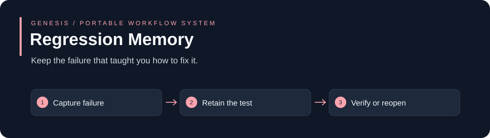

# Regression Memory

Keep the failure that taught you how to fix it.

**Node.js 22.23.2 / 24.14.0 · Built-in modules only · MIT · No daemon or model account required**

[Why use it](#why-use-it) · [Quickstart](#quickstart) · [API and examples](#api-and-examples) · [Limits](#limits)

## Why use it

A fix passes once, then a later edit weakens its test or changes the artifact. Retain the original failure and reopen stale resolutions.

Use it for: **Reproducible defects, recurring integration failures and regression review.**

| A common starting point | This system adds | Why that helps |
| --- | --- | --- |
| Implicit assumptions and scattered state | An explicit, bounded input contract | You can inspect what was actually considered |
| A success flag | A structured result with gaps and failure cases | Missing evidence remains visible |
| A one-time example | Runnable positive and negative fixtures | You can test the behavior before adopting it |

This is a small library you integrate into your application. It is useful when this particular control is missing; it does not replace your existing agent, CI or business policy. These are design differences, not benchmark claims of superiority.

## Quickstart

```sh
# Extract this downloaded ZIP, then open a terminal in its top-level folder.
cd genesis-regression-memory
npm test
npm run demo
```

No dependency installation is needed. Tests use temporary synthetic data and do not contact customers, charge payments or call model providers.

## API and examples

Exports: **createRegression, resolveRegression, reopenRegression**. See [the implementation](index.cjs), [runnable demo](examples/demo.cjs) and [complete input fixtures](test/index.test.cjs).

```js
// Executable synthetic lifecycle fixture; never a claim of real reviewer approval.
const {spawnSync}=require('node:child_process');
console.log('Synthetic Regression Memory lifecycle with real temporary files and checks.');
const env={...process.env};delete env.NODE_TEST_CONTEXT;
const r=spawnSync(process.execPath,['--test','--test-reporter=tap','test/index.test.cjs'],{cwd:require('node:path').resolve(__dirname,'..'),stdio:'inherit',env,windowsHide:true,timeout:60000});
process.exitCode=r.status===0?0:1;
```

The tests document valid contracts, stale evidence, missing fields and failure behavior. Synthetic fixtures demonstrate mechanics; their values are not measured product-performance results. Use only authorized inputs in a real workflow.

## How it connects

1. **Capture failure.**
2. **Retain the test.**
3. **Verify or reopen.**

Use this module independently or find it in the Genesis Suite (available in the separately published source repository). The suite connects planning, bounded workers, adaptation and evidence. Operational orchestration remains the responsibility of the host application.

## Limits

Requires typed Node TAP check results from the supported Node.js 22.23.2 or 24.14.0 lines. Node.js 20 output is intentionally rejected because it lacks the check-type metadata needed to distinguish suites from executed tests. A useful reproducer must be authored and executed; this module does not generate tests or authenticate the runner.

Workflow memory and recorded lessons do not train model weights. No claim of doubled quality or 59–90% cost savings has been established by these fixtures. Paired accepted-task measurements are required before making a savings claim.

## Verification and contribution

Run `npm test` before proposing changes. Include a reproducer for a defect and preserve negative tests. GitHub Actions runs the same suite on Linux and Windows. The [MIT license](LICENSE) permits reuse and white-label adaptation; keep its copyright notice.
